# Dwmac


**Dwmac** is a tiling window manager for macOS. Built on top of [AeroSpace](https://github.com/nikitabobko/AeroSpace), it has evolved drastically into a different project. It offers a distinct window management style, having simplified core logic and added features tailored for a **dwm-style** experience. It follows a **master-stack tiling paradigm**, offering efficient window management without disabling SIP.

## 🚀 Key Features

- **Master-Stack Tiling**: Windows are arranged in a master-stack layout, featuring a primary window and a vertical or horizontal stack of secondary windows.
- **Virtual Workspaces**: Implements its own workspace system, independent of macOS Spaces, allowing for instant switching without animations.
- **Plain Text Config**: Fully configurable via TOML files (dotfiles friendly).
- **CLI-First**: Extensive command-line interface `dwmac` for scripting and control.
- **Multi-Monitor**: strong multi-monitor support.
- **SIP-Compatible**: Does **not** require disabling System Integrity Protection.

### 🖼️ Layout Visualization

#### Horizontal Master-Stack (Default)

```mermaid
graph TD
    subgraph MonitorH ["🖥️ Monitor"]
        MasterH["Master Area<br>Main Focus"] --> StackH[Stack Area]
        subgraph StackH
            W1H[Window 2] --> W2H[Window 3]
        end
    end
    style MasterH fill:#d4a5a5,stroke:#333,stroke-width:2px,color:#000
    style StackH fill:#a5d4d4,stroke:#333,stroke-width:2px,color:#000
    style W1H fill:#fff,stroke:#333,color:#000
    style W2H fill:#fff,stroke:#333,color:#000
```


#### Vertical Master-Stack

```mermaid
graph LR
    subgraph MonitorV ["🖥️ Monitor"]
        MasterV["Master Area<br>Main Focus"] --> StackV[Stack Area]
        subgraph StackV
            W1V[Window 2] --> W2V[Window 3]
        end
    end
    style MasterV fill:#d4a5a5,stroke:#333,stroke-width:2px,color:#000
    style StackV fill:#a5d4d4,stroke:#333,stroke-width:2px,color:#000
    style W1V fill:#fff,stroke:#333,color:#000
    style W2V fill:#fff,stroke:#333,color:#000
```


### 🧩 Workspace Architecture


## 📦 Installation

### Option 1: Homebrew (Recommended)

You can install Dwmac using the custom Homebrew tap:

```bash
brew tap hillyu/tap
brew install --cask dwmac
```

### Option 2: Build from Source

Requirements: Xcode 16+

1.  Clone the repository:
    ```bash
    git clone https://github.com/hillyu/dwmac.git
    cd dwmac
    ```
2.  Run the installation script:
    ```bash
    ./install-from-sources.sh
    ```
    This will compile the release build and install it to `/Applications/Dwmac.app`.

## 🔄 Changes from AeroSpace

Dwmac is based on AeroSpace. If you are migrating, please note the following changes:

| Category | Original (AeroSpace) | New (Dwmac) |
| :--- | :--- | :--- |
| **App Name** | AeroSpace | **Dwmac** |
| **CLI Command** | `aerospace` | **`dwmac`** |
| **Layouts** | Multiple | **Master-stack only** |
| **Config File** | `.aerospace.toml` | **`.dwmac.toml`** |
| **Config Location** | `~/.config/aerospace/aerospace.toml` | **`~/.config/dwmac/dwmac.toml`** |
| **Env Variables** | `AEROSPACE_*` (e.g., `AEROSPACE_WORKSPACE`) | **`DWMAC_*`** (e.g., `DWMAC_WORKSPACE`) |
| **Bundle ID** | `bobko.aerospace` | **`hillyu.dwmac`** |

## 📚 Documentation

- [Guide](https://hillyu.github.io/dwmac/guide)
- [Commands](https://hillyu.github.io/dwmac/commands)
- [Configuration Examples](https://github.com/hillyu/dwmac/tree/main/docs/config-examples)

## 🤝 Contributing

Contributions are welcome! Please feel free to submit a Pull Request or open a Discussion.

## 📄 License

MIT License. See [LICENSE.txt](./LICENSE.txt) for details.
